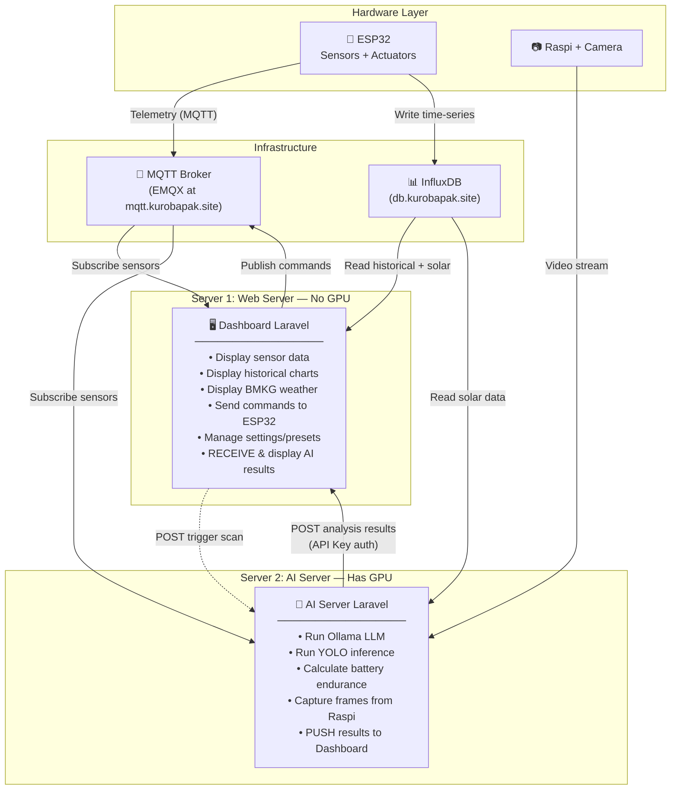

# SmartGarden BRIN — Architecture: Separating Dashboard & AI Server

---

## Background

The SmartGarden BRIN project currently runs as **a single Laravel application** that handles everything: serving the dashboard UI, receiving sensor data via MQTT, AND running AI processing (Ollama LLM + YOLO plant disease detection). This is architecturally flawed because AI processing is resource-heavy and should never run on a web server.

We have **2 physical servers** with different capabilities:
- **Web Server** — serves user traffic, no GPU
- **AI Server** — has a dedicated GPU, purpose-built for AI workloads

The architecture must be split into **2 separate Laravel applications** that communicate with each other.

---

## What Currently Exists in the Dashboard

### Features that BELONG here (keep in Dashboard):

| Feature | How It Works |
|---------|-------------|
| **Real-time Sensors** | Browser subscribes to MQTT via WebSocket (`mqtt.js`), sensor data rendered live |
| **MQTT Commands** | Dashboard publishes commands to ESP32 (manual pump override, config sync) |
| **Historical Chart** | Dashboard queries InfluxDB, renders chart with Chart.js |
| **BMKG Weather** | Dashboard fetches BMKG API, displays forecast table |
| **Settings & Presets** | CRUD device config + plant presets, stored in MySQL |
| **Solar Panel Data** | Dashboard queries InfluxDB `solar_data` bucket, displays energy metrics |

### Features that DON'T BELONG here (must move out):

#### 1. Ollama LLM — Energy Recommendations

Currently, the dashboard collects sensor data + weather + solar info, sends it all to Ollama (`localhost:11434`), and waits 30-120 seconds for a recommendation like "🟢 System Normal: all actuators operational...". **This blocks the web server** — while Ollama is thinking, the web server thread is locked and other users must wait in line.

#### 2. Smart Battery AI — Energy Calculations

Currently there's a JavaScript function running in the browser that calculates net power, battery endurance estimates, and solar forecasts based on BMKG cloud cover data. Although lightweight, analysis/prediction logic does not belong in the dashboard.

#### 3. Plant Disease Detection — YOLO

Currently uses **file-based communication**, which is extremely fragile: a separate Python script captures images from a Raspi camera, runs YOLO inference, then writes JSON + image files to the `public/plant_scans/` folder. The dashboard simply reads these files. Not scalable and prone to race conditions.

---

## New Architecture



---

## Data Flow — Before vs After

### Ollama Energy Analysis

**Before (wrong ❌):**
```
Browser → Dashboard → Ollama (30-120 sec blocking!) → Dashboard → Browser
```
The dashboard does everything: collect data, send to Ollama, wait for response, send back to browser. Web server is blocked the entire time.

**After (correct ✅):**
```
AI Server (scheduled) → collect data → process via Ollama → POST results to Dashboard
Browser → Dashboard → fetch latest result from database → display
```
The dashboard does zero processing. It just stores and displays pre-computed results.

---

### Plant Disease Detection

**Before (fragile ⚠️):**
```
Raspi → Python script on laptop → write files to public/plant_scans/ → Dashboard reads files
```
File-based. If a file is corrupted, there's a race condition, or the Python script dies — the dashboard has no idea.

**After (proper ✅):**
```
AI Server → capture frame from Raspi → YOLO inference → POST results + image to Dashboard API
Dashboard → store in database + storage → serve to user
```
Proper API communication with validation and error handling.

---

### Smart Battery AI

**Before:**
```
JavaScript in browser → calculate net power, endurance, solar forecast from BMKG data
```
Calculation logic lives client-side, scattered across the frontend.

**After:**
```
AI Server → compute everything (net power, endurance, forecast) → include in energy analysis payload
Dashboard → display pre-computed values
```

---

## Communication Between the 2 Servers

Both servers communicate via **REST API** with a **shared API key** for authentication:

### AI Server → Dashboard (Push Results)

The AI Server periodically (e.g. every 5-30 minutes) sends analysis results to the Dashboard:

| Dashboard Endpoint | Data Received | Frequency |
|-------------------|--------------|-----------|
| `POST /api/ai/energy-analysis` | Ollama output + battery calculations | Every ~30 minutes |
| `POST /api/ai/plant-scan` | YOLO results + image + disease status | Every ~5 minutes |

All requests from the AI Server must include an **API Key in the header** (`X-API-Key`) so the Dashboard can validate that the request is genuinely from the authorized AI Server.

### Dashboard → AI Server (Manual Trigger)

When a user clicks "Capture Now" on the dashboard, the Dashboard forwards the request to the AI Server:

| AI Server Endpoint | Purpose |
|-------------------|---------|
| `POST /api/scan/trigger` | Request the AI Server to perform a plant scan immediately |

The AI Server processes the scan, then pushes results back to the Dashboard via the endpoints above.

### Dashboard → Browser (Serve Results)

The frontend simply **polls** (periodic fetch) internal endpoints to retrieve the latest AI results:

| Dashboard Endpoint | Purpose | Polling Interval |
|-------------------|---------|-----------------|
| `GET /api/ai/energy-analysis/latest` | Get latest energy analysis | Every ~30 seconds |
| `GET /api/ai/plant-scan/latest` | Get latest plant scan | Every ~30 seconds |
| `GET /api/ai/plant-scan/history` | List scan history | On-demand |

---

## What Needs to Be Done — Per Side

### Dashboard Side (Web Server)

**Remove:**
- All Ollama code (controller, service, routes, frontend JS)
- File-based plant scan system (routes reading from filesystem, `public/plant_scans/` folder)
- Smart Battery AI calculation in JavaScript
- Ollama ENV config variables

**Add:**
- Database table to store AI results received from the AI Server
- API endpoints to **receive** results from the AI Server (protected by API key)
- API endpoints to **serve** results to the frontend
- Endpoint to **forward** trigger scan requests to the AI Server
- Frontend JS that only fetches and displays data (no processing)

**Keep as-is:**
- MQTT WebSocket for real-time sensors
- InfluxDB queries for charts and solar data
- BMKG weather display
- Settings & presets management
- All MQTT command publishing

---

### AI Server Side (GPU Server)

**Build from scratch:**
- Separate Laravel application
- Ollama integration (can use `OllamaService.php` from the dashboard as a starting point)
- YOLO integration (port logic from the now-deleted `plant_disease_scanner.py`)
- Subscribe to MQTT for real-time sensor data
- Query InfluxDB for solar panel data
- Fetch BMKG API for weather data
- Battery endurance & solar forecast calculations
- Scheduler to run periodic analyses
- Endpoint to receive trigger scan requests from the Dashboard
- Logic to push results to the Dashboard via API

---

## Why This Architecture Is Better

| Aspect | Before (1 server) | After (2 servers) |
|--------|-------------------|-------------------|
| **Reliability** | AI crash = dashboard down | AI crash, dashboard stays up |
| **Performance** | Ollama blocks web threads | AI runs in background, dashboard stays responsive |
| **Scalability** | GPU + Web on 1 machine | Each can scale independently |
| **Resources** | Web server needs GPU (expensive) | GPU only on the AI server |
| **Maintenance** | Everything mixed together | Clear separation, teams can work in parallel |
